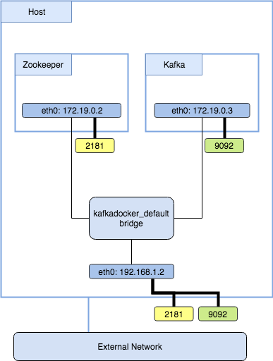

Kafka connectivity
==================

A large percentage of questions and issues opened against the kafka-docker project concern configuring Kafka networking. This is often a case of not understanding the Kafka requirements, or not understanding docker networking.

This page aims to explain some of the basic requirements to help people resolve any initial issues they may encounter. It is not an exhaustive guide to configuring Kafka and/or Docker.

Kafka requirements
------------------

There are three main requirements for configuring Kafka networking.

1.	Each Broker must be able to talk to Zookeeper - for leader election etc.
2.	Each Broker must be able to talk to every other Broker - for replication etc.
3.	Each Consumer/Producer must be able to talk to every Broker - for reading/writing data etc.

The following diagram represents the different communication paths:


This means for a complete working Kafka setup, each one of the components must be able to route to the other and have accessible ports.

Kafka in Docker
---------------

First, let's take a look at the simplest use-case - running a single Kafka broker.

```
# KAFKA_ADVERTISED_HOST_NAME: localhost
# ZOOKEEPER_CONNECT: zookeeper:2181
docker-compose -f docker-compose-single-broker.yml up -d
```



Two containers are created which share the `kafkadocker_default` bridge network created by docker-compose. Here you can see both ports from the container are mapped directly to the host's network interface (2181 and 9092)

**NOTE:** When using docker-compose, all containers are generally started in the same networking namespace. I say 'generally' as you can configure multiple networks, but we're sticking to the simple use-case here.

In this setup all Kafka requirements are met:

1.	the Kafka container can talk to Zookeeper via the `zookeeper` DNS entry that exists within the `kafkadocker_default` network
2.	the Kafka container can talk to itself on `localhost:9092` (within the containers networking namespace)
3.	Consumers and Producers can talk to the Kafka broker using `localhost:9092` address. This is because docker will generally bind the port to all interfaces (0.0.0.0) when it is published.

```
$ docker ps
CONTAINER ID        IMAGE                      PORTS                                                NAMES
1bf0d78a352c        wurstmeister/zookeeper     22/tcp, 2888/tcp, 3888/tcp, 0.0.0.0:2181->2181/tcp   kafkadocker_zookeeper_1
d0c932301db5        kafkadocker_kafka          0.0.0.0:9092->9092/tcp                               kafkadocker_kafka_1
```

Next, let's look at the common use-case - running multiple Kafka brokers.

```
# KAFKA_ADVERTISED_HOST_NAME: 192.168.1.2
# ZOOKEEPER_CONNET: zookeeper:2181
docker-compose up -d zookeeper
docker-compose scale kafka=2
```


Here, the key differences are two configurations in the `docker-compose.yml` file; `ports` and the `KAFKA_ADVERTISED_HOST_NAME` environment variable.

Because it is only possible to bind to each unique port once on a single interface, we can no longer publish the Broker port (9092). Instead, we simply expose the port.

```
ports:
  - "9092"
```

This results in docker binding an ephemeral port on the host interface to the container port.

```
$ docker ps
CONTAINER ID        IMAGE                      PORTS                                                NAMES
2c3fe5e651bf        kafkadocker_kafka          0.0.0.0:32000->9092/tcp                              kafkadocker_kafka_2
4e22d3d715ec        kafkadocker_kafka          0.0.0.0:32001->9092/tcp                              kafkadocker_kafka_1
bfb5545efe6b        wurstmeister/zookeeper     22/tcp, 2888/tcp, 3888/tcp, 0.0.0.0:2181->2181/tcp   kafkadocker_zookeeper_1
```

This should hopefully explain why we had to use the hosts interface address in the `KAFKA_ADVERTISED_HOST_NAME` environment var. Let's cement this understanding by adding consumers / producers to the diagram:


This explains why all Kafka requirements are met:

1.	The Kafka containers can still use the `zookeeper` DNS entry to talk to zookeeper in the `kafkadocker_default` network
2.	The Kafka containers can talk to each other by routing from the `kafkadocker_default` bridge network to the listening host interface ( `192.168.1.2:32000` and `192.168.1.2:32001` )
3.	Consumers and Producers and also talk to the Kafka containers by the host interface ( `192.168.1.2:32000` and `192.168.1.2:32001` )

**NOTE:** It is worth pointing out that the `kafka-console-producer.sh` shell container is started on the `default` bridge because it was simply started with the `docker run` command (see the `start-kafka-shell.sh` script)

For completeness, here is a `kafkacat` example:

```
# Publish
kafkacat -b 192.168.1.2:32000,192.168.1.2:32001 -P -t test

# Consume
kafkacat -b 192.168.1.2:32000,192.168.1.2:32001 -C -t test
```

Additional Listener information
===============================

The following is a little more background information, optional, but supplementary to the above documentation.

Internal versus Advertised
--------------------------

Kafka has always had the notion of an 'advertised' host and port. This is a mechanism to allow the public address of a node (i.e. DNS record) to be different to an internal address. This is especially useful if you have elastic compute and do not necessarily know what the IP of a broker will be.

The broker registers the information from its config with Zookeeper when it starts up. It looks something like this:

```
{
  "listener_security_protocol_map": {
    "PLAINTEXT": "PLAINTEXT"
  },
  "endpoints": [
    "PLAINTEXT://one.prod.com:9092"
  ],
  "jmx_port": -1,
  "host": "one.prod.com",
  "timestamp": "1520972878198",
  "port": 9092,
  "version": 4
}
```

During a Client (Consumer/Producer) bootstrap process, it will connect to either Zookeeper/Kafka (depending on the version and implementation) to receive a list of meta-data.

Meta-data contains information for topics, specifically which broker is responsible for a partition. The broker information returned will be based on the `advertised.host.name`/`advertised.port` configuration (if specified).

An abbrieviated example is shown below:

```
{
  brokers: [id:1001,host:one.prod.com,port:9092],
  topics: {
    "test": [
      {partition:0, leader:1001, replicas:[1001,1002], isrs:[1001,1002]},
      {partition:1, leader:1002, replicas:[1002,1003], isrs:[1002,1003]},
      {partition:2, leader:1003, replicas:[1003,1001], isrs:[1003,1002]},
      ... snip ...
    ]
  }
}
```

Since Kafka 0.9.0 - it has been possible to specify multiple ports for listening on. This is to facilitate support for multiple protocols (i.e. PLAINTEXT,SASL,SSL etc) and separate internal and external traffic. With this change, `host.name` and `port` have been deprecated in favour of `listeners`. `advertised.host.name` and `advertised.port` have been deprecated in favour of `advertised.listeners`.

Below is the same configuration represented in the deprecated and current formats:

**Deprecated**

```
KAFKA_HOST:
KAFKA_PORT: 9092
KAFKA_ADVERTISED_HOST_NAME: one.prod.com
KAFKA_ADVERTISED_PORT: 9092
```

**Current**

```
KAFKA_LISTENERS: PLAINTEXT://:9092
KAFKA_ADVERTISED_LISTENERS: PLAINTEXT://one.prod.com:9092
```
